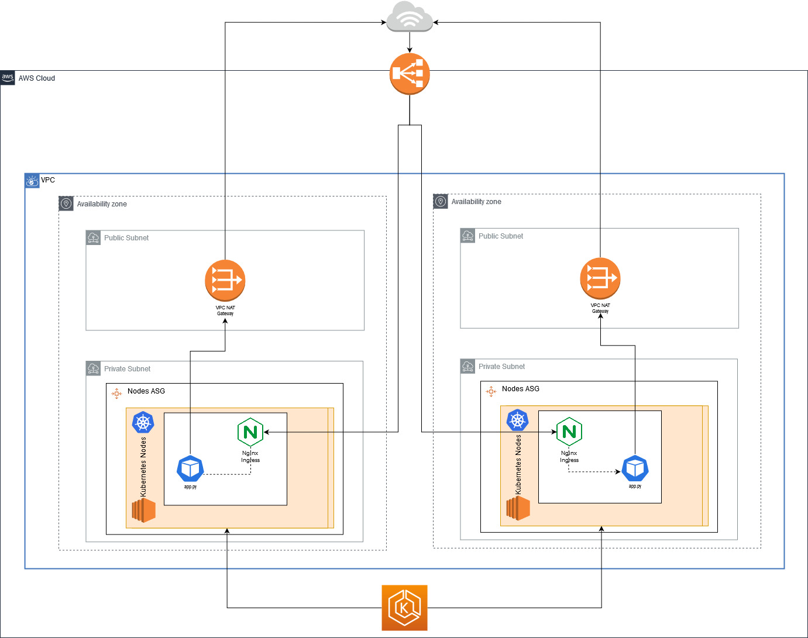

# K8s Demo

This project can be used as a reference to deploy a simple flask application running in AWS in Kubernetes.

The stack for this example is the following:

- [Docker](https://docs.docker.com/get-started/)
- A [Kubernetes](https://Kubernetes.io/docs/setup/) "cluster" running in a [Ubuntu](https://ubuntu.com/) machine with [Microk8s](https://microk8s.io/#get-started) on [AWS EC2](https://aws.amazon.com/pt/ec2/)
- [Helm](https://helm.sh/) - A "package manager" for kubernetes applications
- [Nginx Ingress Controller](https://Kubernetes.github.io/ingress-nginx/)
- [Certmanager](https://cert-manager.io/docs/) + [Let’s Encrypt](https://letsencrypt.org/) for TLS
- [GitHub Actions](.github/workflows/deploy.yml) for CI/CD



## Requirements

- git
- kubectl
- helm 3+
- awscli
- terraform 0.12+

## How to use this project

**WARNING:** Deploying this to your AWS account will incur in costs
// TODO

1. Clone
2. Create terraform backend in your account
3. Setup secrets on github actions

## The application

For reference this repository uses the [Flask Minimal Application](https://flask.palletsprojects.com/en/1.1.x/quickstart/#a-minimal-application) that returns a simple "Hello world".

```bash
$ flask run
 * Environment: production
   WARNING: This is a development server. Do not use it in a production deployment.
   Use a production WSGI server instead.
 * Debug mode: off
 * Running on http://127.0.0.1:5000/ (Press CTRL+C to quit)
```

Also, when starting the application we are warned by Flask to `Use a production WSGI server instead`. There are [many ways](https://flask.palletsprojects.com/en/1.1.x/deploying/) to deploy a flask app, but since our goal is to use it in a docker container, let's use one of the recommended [Standalone WSGI Containers](https://flask.palletsprojects.com/en/1.1.x/deploying/wsgi-standalone/), in our case [Gunicorn](https://gunicorn.org/).

```bash
$ gunicorn -w 4 --bind 0.0.0.0:5000 app:app
[2020-05-23 18:50:56 +0100] [14880] [INFO] Starting gunicorn 20.0.4
[2020-05-23 18:50:56 +0100] [14880] [INFO] Listening at: http://0.0.0.0:5000 (14880)
[2020-05-23 18:50:56 +0100] [14880] [INFO] Using worker: sync
[2020-05-23 18:50:56 +0100] [14883] [INFO] Booting worker with pid: 14883
[2020-05-23 18:50:56 +0100] [14884] [INFO] Booting worker with pid: 14884
[2020-05-23 18:50:56 +0100] [14885] [INFO] Booting worker with pid: 14885
[2020-05-23 18:50:56 +0100] [14886] [INFO] Booting worker with pid: 14886
```

## Create a Docker Image

The definition for the Docker image can be found in the [Dockerfile](Dockerfile).

As a base image for our docker image we are using one of the [official docker images](https://hub.docker.com/_/python/) for python. For our application we use the tag `python:3.8-slim-buster`. The `3.8` stands for the python version, the `buster` stands for the [version of debian](https://www.debian.org/releases/buster/) that is used as the underlying image, and the `slim` stands for the [image variant](https://hub.docker.com/_/debian?tab=description) of debian which is more or less half the size as the "full fledged" debian image.

Other than that we just need to copy our `requirements.pip` and `app.py` to the workdir of our docker image and define the initial command to be executed when our image is ran.

```bash
$ docker run -it --name k8s-demo k8s-demo:latest
[2020-05-23 19:59:05 +0000] [6] [INFO] Starting gunicorn 20.0.4
[2020-05-23 19:59:05 +0000] [6] [INFO] Listening at: http://0.0.0.0:11130 (6)
[2020-05-23 19:59:05 +0000] [6] [INFO] Using worker: sync
[2020-05-23 19:59:05 +0000] [8] [INFO] Booting worker with pid: 8
[2020-05-23 19:59:05 +0000] [9] [INFO] Booting worker with pid: 9
[2020-05-23 19:59:05 +0000] [10] [INFO] Booting worker with pid: 10
[2020-05-23 19:59:05 +0000] [11] [INFO] Booting worker with pid: 11
```

## Create an Helm Chart

The easiest way to create a chart is by using the `helm create` [command](https://helm.sh/docs/helm/helm_create/#helm).
The default chart already brings some really interesting things that make it easier for us to be following some Kubernetes best practices:

- Standard labels that are added to all the Kubernetes resources
- A [Deployment](./chart/k8s-demo/templates/deployment.yaml) file with configurable resources, nodeSelectors, affinity and tolerations.
- An [HorizontalPodAutoscaler](./chart/k8s-demo/templates/hpa.yaml) that will add or remove containers/pods based on a target CPU and Memory usage.
- A new [ServiceAccount](chart/k8s-demo/templates/serviceaccount.yaml) specific to our application. By default, new service accounts don't have any permissions.
- A [Service](chart/k8s-demo/templates/service.yaml) to make our application accessible by other pods **inside** the cluster.
- An [Ingress](chart/k8s-demo/templates/ingress.yaml) to make our application accessible **outside** of our cluster.
- A [Helm test](chart/k8s-demo/templates/tests/test-connection.yaml) that can be used to check if our application is running after we install it. By default it runs a simple `$ wget {service.name}:{service.port}`.

In this repository the helm chart can be found under the `chart/` directory.
The only change we need to do to have a working Helm chart is to change the `image.repostory` in the [values.yaml](chart/k8s-demo/values.yaml) to use our docker image.

## Infrastructure

In the [infrastructure/](infrastructure/) directory, there are a set of terraform templates that create the entire AWS infrastructure.
You can check the image at the top of this file to get a sense of what kind of resources it creates, but it goes more or less like this:

- Network - A VPC with 2 private subnets and 2 public subnets and a NAT gateway to provide access
- Cluster Master - The managed EKS, kubernetes master
- Cluster Workers - A set of EC2 instances where our pods/containers will be deployed.

It also enables some nice things, like:

- All the logs from the kubernetes master going to cloudwatch
- Installs the ssm agent in the nodes, so you can use IAM authentication to "ssh" to the nodes.

### Usage

Assuming you have your `~/.aws/credentials` correctly configured:

```bash
export AWS_SDK_LOAD_CONFIG=1 # Tell the sdk from terraform to load the aws config
# export AWS_PROFILE=sandbox_role  # Setup a correct AWS_PROFILE if needed
```

Also, take a look at the `config.tf` files and check the AWS region. By default it uses `eu-west-1`.

#### Create the storage for the terraform state

Terraform needs a place to store the current state of your infrastructure.
Gladly a nice way to store this state is using and S3 bucket and a DynamoDB table.

In the [infrastructure/backend/](infrastructure/backend/) directory you can find a set
of terraform templates that create a bucket for you called `bucket=terraform-state-$ACCOUNT_ID` and a dynamodb.

You can create it like this:

```bash
cd backend/
terraform init && terraform apply
```

#### Deploy the infrastructure

After you have you backend storage created, you can deploy the entire infrastructure like this:

```bash
cd ../main/
export ACCOUNT_ID=$(aws sts get-caller-identity --query Account --output text)
terraform init -backend-config="bucket=terraform-state-$ACCOUNT_ID"
terraform apply
```

After 15-20m the entire infrastructure should be created.
You can now configure your local kubectl to access the new kubernetes cluster:

```bash
$ aws eks update-kubeconfig --name k8sdemo-cluster
...
$ kubectl get pods --all-namespaces
```

## Deploying our Application

The application is quite simple to deploy, you just need to create a namespace and use helm to install everything:

```bash
$ kubectl create namespace k8s-demo
namespace/k8s-demo created
```

```bash
$ helm upgrade --install k8s-demo chart/k8s-demo/ --namespace k8s-demo
Release "k8s-demo" does not exist. Installing it now.
NAME: k8s-demo
LAST DEPLOYED: Mon May 25 21:29:30 2020
NAMESPACE: k8s-demo
STATUS: deployed
REVISION: 1
NOTES:
1. Get the application URL by running these commands:
  export POD_NAME=$(kubectl get pods --namespace k8s-demo -l "app.kubernetes.io/name=k8s-demo,app.kubernetes.io/instance=k8s-demo" -o jsonpath="{.items[0].metadata.name}")
  echo "Visit http://127.0.0.1:8080 to use your application"
  kubectl --namespace k8s-demo port-forward $POD_NAME 8080:80
```

### Enable TLS

To enable access to our application from the internet we are using the nginx ingress controller and certmanager to automatically generate/renew the certificate.
For simplicity we added them to the chart on this repo as a dependency, it is created if we set `nginxingress.enabled=true` and `certmanager.enabled=true`.

This is what you need to do to enable it (make sure to replace the example.com with your domain):

```bash
# Kubernetes 1.15+
# https://cert-manager.io/docs/installation/kubernetes/#installing-with-regular-manifests
$ kubectl apply --validate=false -f https://github.com/jetstack/cert-manager/releases/download/v0.15.0/cert-manager.crds.yaml
```

```bash
helm upgrade --install k8s-demo chart/k8s-demo/ --namespace k8s-demo \
  --set ingress.enabled=true \
  --set ingress.hosts[0].host=example.com \
  --set ingress.hosts[0].paths[0]="/" \
  --set ingress.tls[0].hosts[0]=example.com \
  --set ingress.tls[0].secretName=k8s-demo-tls \
  --set nginxingress.enabled=true \
  --set certmanager.enabled=true \
  --set certmanager.issuer.email=example@gmail.com
```

```bash
$ kubectl get ingress -n k8s-demo
NAME       HOSTS                  ADDRESS                                                                   PORTS     AGE
k8s-demo   k8s-demo.arvoros.com   ad6efd9329ed411ea8d7d02ae17452ae-1611130781.eu-west-1.elb.amazonaws.com   80, 443   3m18s
```

Now, you can got to your DNS provider and create a CNAME record pointing your domain to the `ADDRESS` of your service.

## Github Action

```

```
